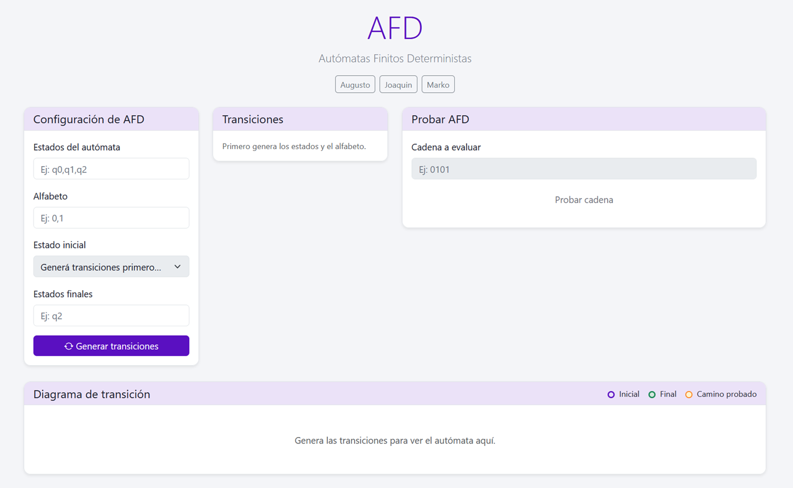

# Simulador de Autómatas Finitos Deterministas (AFD)

## Descripción

Herramienta web interactiva para diseñar, configurar y probar **Autómatas Finitos Deterministas (AFD)** y resolver ejercicios de **Autómatas de Pila (APD)**. Permite definir estados, alfabeto, transiciones, estado inicial y estados finales; evaluar cadenas; visualizar el **diagrama de transición** con resaltado del camino recorrido; y trabajar con una segunda página dedicada a problemas de pila.

---

### Sitio web original

https://automatafinito.netlify.app/

### Sitio web renovado
https://main.d2c6qehfhp6tcg.amplifyapp.com/

---

## Características

- **Configuración del AFD**: estados y alfabeto (listas separadas por comas), estado inicial, estados finales y tabla de transiciones generada dinámicamente.
- **Simulación**: prueba de cadenas con mensaje de aceptación o rechazo y **camino de estados** mostrado en pantalla.
- **Diagrama de transición**: grafo interactivo con [Cytoscape.js](https://js.cytoscape.org/); al probar una cadena se resaltan estados y aristas del recorrido (clic en el diagrama para quitar el resaltado).
- **Segunda página de APD**: editor de transiciones tipo pila, simulación paso a paso y traza de configuración para resolver problemas clásicos como balanceo de paréntesis o lenguajes con estructura anidada.
- **Interfaz con Vue 3**: formularios y estado reactivos ([Vue](https://vuejs.org/) vía CDN).
- **Tema claro / oscuro**: botón fijo (🌙 / ☀️) en la esquina superior derecha; el tema se sincroniza con `data-bs-theme` de Bootstrap para formularios coherentes en ambos modos.
- **Estilo**: color de acento **#5a10c1**; diseño responsive con Bootstrap 5.
- **Ejecución local**: abre `index.html` en el navegador; **no hace falta** instalar dependencias ni ejecutar build (las librerías se cargan por CDN).

---

## Cómo usar el simulador

### 1. Configuración del autómata

1. **Estados**: nombres separados por comas (ej. `q0,q1,q2` o `A,B,C`).
2. **Alfabeto**: símbolos separados por comas (ej. `0,1`, `a,b,c`).
3. Pulsa **Generar transiciones** para crear la tabla. Hasta entonces, el campo **Estado inicial** muestra un texto indicativo.
4. **Estado inicial**: elige el estado en el desplegable (habilitado tras generar).
5. **Estados finales**: estados de aceptación separados por comas (ej. `q2` o `A,C`).

### 2. Definir transiciones

Para cada estado y cada símbolo del alfabeto, elige el **estado destino** en el desplegable correspondiente.

### 3. Probar cadenas

1. Escribe la cadena en **Cadena a evaluar** (ej. `0101`, `aab`).
2. Pulsa **Probar cadena**.
3. Verás si la cadena es **aceptada** o **rechazada** y el **camino** de estados. El diagrama inferior refleja el mismo recorrido resaltado.

---

## Página de APD

La segunda página, accesible desde [pda.html](pda.html), permite plantear y resolver problemas de autómatas de pila.

### Cómo describir las transiciones

Cada línea usa este formato:

```text
estado_origen, simbolo_entrada, tope_pila -> estado_destino, reemplazo_pila
```

- Usa `ε` cuando la transición no consume entrada.
- Usa `ε` en el reemplazo para indicar que solo se hace pop.
- El reemplazo se interpreta de izquierda a derecha: el primer símbolo escrito queda arriba de la pila.

### Qué muestra la simulación

- Estado actual.
- Entrada restante.
- Pila en cada paso.
- Secuencia completa de configuraciones y la transición aplicada.

La página incluye un ejemplo cargable para problemas de paréntesis balanceados.

---

## Ejemplos prácticos

### Ejemplo 1: número par de unos

- **Estados**: `q0,q1`
- **Alfabeto**: `0,1`
- **Estado inicial**: `q0`
- **Estados finales**: `q0`
- **Transiciones** (resumen): desde `q0`, `0→q0` y `1→q1`; desde `q1`, `0→q1` y `1→q0`.

**Prueba**: acepta `""`, `00`, `110`; rechaza `1`, `01`, `111`.

### Ejemplo 2: número par de “a” con otros símbolos

- **Alfabeto**: `a,b,c`
- Ajusta transiciones para alternar entre estados al leer `a` y mantener el estado con `b` y `c` según tu diseño.

---

## Tecnologías

| Área        | Uso |
|------------|-----|
| HTML5 / CSS3 | Estructura y estilos propios (`styles.css`) |
| [Vue 3](https://vuejs.org/) (CDN) | Interfaz reactiva (`main.js`) |
| [Bootstrap 5](https://getbootstrap.com/) | Layout y componentes |
| [Cytoscape.js](https://js.cytoscape.org/) (CDN) | Diagrama de estados y transiciones |
| [Bootstrap Icons](https://icons.getbootstrap.com/) | Iconos |

---

## Estructura del proyecto

```
Simulador-de-Automatas-Finitos-Deterministas-AFD/
├── index.html          # Shell de la app Vue y carga de scripts (CDN)
├── main.js             # Lógica del AFD, Vue y Cytoscape
├── pda.html            # Segunda página para problemas de autómatas de pila
├── pda.js              # Lógica del simulador de APD
├── styles.css          # Variables de tema, acento y modo oscuro
└── README.md
```

---

## Instalación y uso local

1. Clona el repositorio:
   ```bash
   git clone https://github.com/MarkoEv/Simulador-de-Automatas-Finitos-Deterministas-AFD.git
   ```
2. Abre `index.html` en un navegador moderno (o sirve la carpeta con un servidor estático opcional).

No se requiere `npm install` para usar la aplicación en local: Vue, Bootstrap y Cytoscape se cargan desde CDN definidos en `index.html`.

---

## Enlaces de autoría

- [MarkoEv](https://github.com/MarkoEv)
- [AugustoOM](https://github.com/AugustoOM)
- [Joaco981](https://github.com/Joaco981)

---

## Licencia

Sin licencia

---

## Contribuciones

Las contribuciones son bienvenidas. Puedes abrir un **Issue** o un **Pull Request**.

---

## Notas

- Útil como apoyo en cursos de teoría de autómatas y lenguajes formales.

---

## Despliegue en AWS Amplify

En el repositorio hay archivos de configuración para publicar el sitio estático en **AWS Amplify Console** (por ejemplo `amplify.yml` y `package.json`).

- Conecta el repositorio en [Amplify Console](https://console.aws.amazon.com/amplify/).
- Amplify puede usar `amplify.yml` como definición de build; al tratarse de HTML/CSS/JS estático, los pasos suelen ser mínimos.

Para más detalle sobre flujos con Amplify CLI u opciones avanzadas, revisa la documentación oficial de AWS Amplify.

---

### Captura de pantalla


